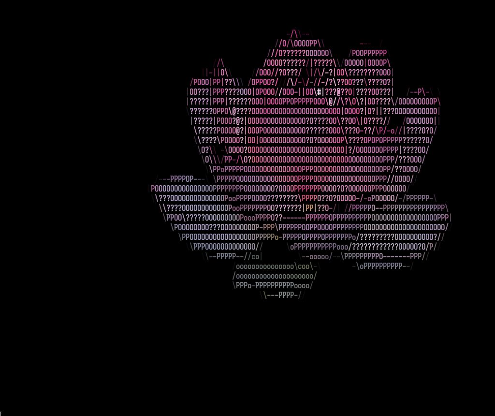
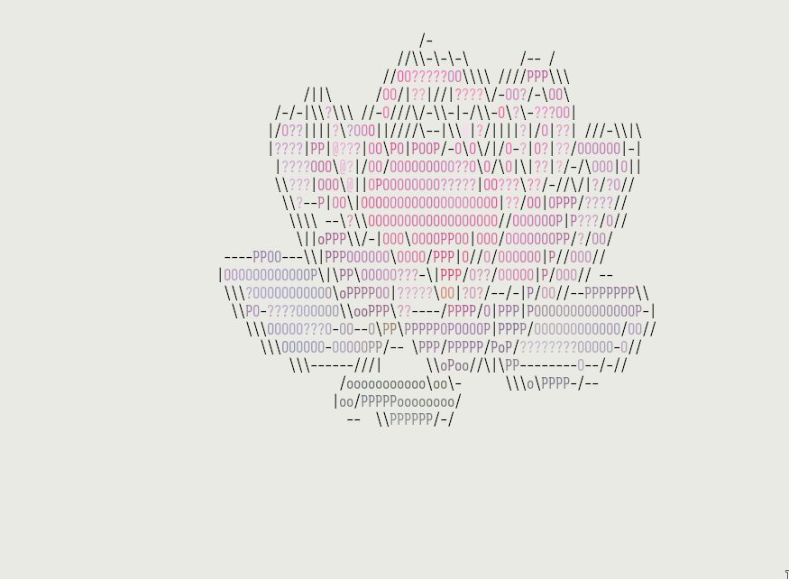

[](https://github.com/psf/black)


**TOC**

1. [features](#planned-features)
2. [examples](#examples)
3. [usage](#usage)
4. [other tools](#other-tools-i-have-looked-at)

# ASCII_IMG - Advanced IMG to ASCII pipeline

With this tool you should be able to convert any image to a good ascii art with
configurable characters and a configurable processing pipeline.

So far countless tools seemed to exist, but i did not find one, that uses edge
detection to use fitting characters that follow an edges direction, an already
solved problem in image recognition applications (besides Acerolas ASCII shader
ofc, but thats a shader and not a program that outputs text).

I also needed to find at least one use for the image processing classes i had,
as they seemed kind of pointless so far; after watching the infamous Acerola
video i also noticed how simple the processing actually is.

## (Planned) Features

- [x] segmentation step for the foreground object
- [x] edge detection and fitting characters
- [x] brightness based characters (10 levels so far)
- [x] truecolor escapes for colored pixels
- [x] configurable kernel sizes
- [x] color binning
- [x] properly deal with terminal fonts (they are not 1:1)
- [ ] GUI/TUI with live reload
- [ ] Automatic Kernel size selection (in CLI/TUI)
- [ ] export as script for neovim dashboards(?)

If you feel like smth is missing open an issue.

## Examples

 


```bash
python -m ascii_img flower.jpg brightness,edge,color -d 7 -s --bg -t 150
```
 

```bash
python -m ascii_img flower.jpg brightness,color,edge -d 9 -
```
 

## Usage

This is still in an early version, so the usage is not finalized, for now you have to use `-h`
and look at the source for the modes (main function in `__init__.py`).

## Other tools i have looked at

[ascii2img](https://github.com/Asthestarsfalll/img2art): mostly uses braille, does not do edge detection
[asciiart.eu](https://www.asciiart.eu/image-to-ascii): online tool, preprocessing steps and configurable character sets, but does not do colors 
